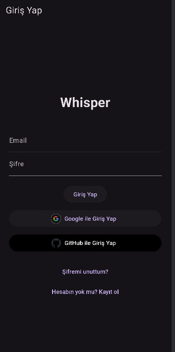
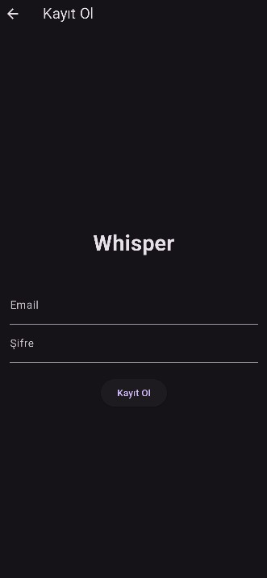
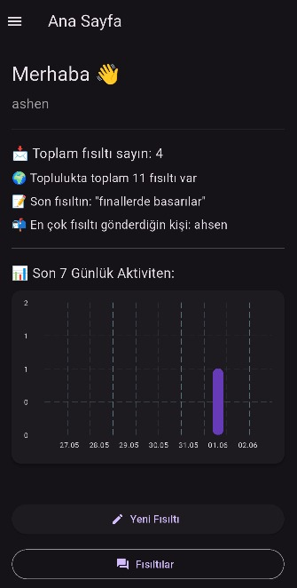
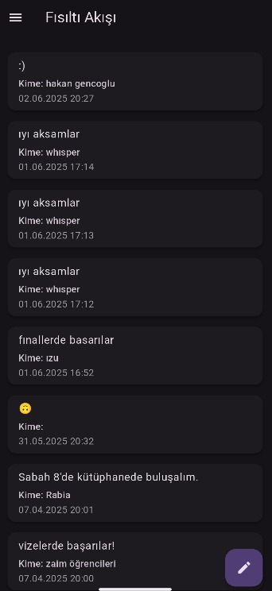
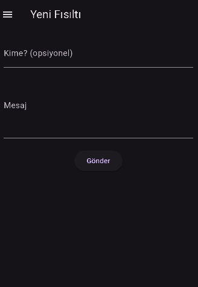
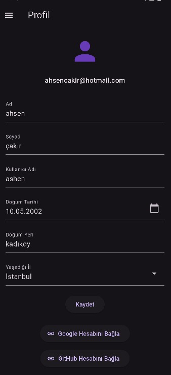
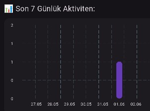
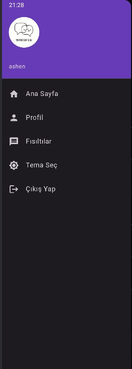

# Whisper

Whisper, Flutter ile geliştirilmiş, kullanıcıların anonim olarak mesajlaşabileceği modern bir sosyal medya uygulamasıdır. Kullanıcı dostu arayüzü ve güvenli altyapısıyla, serbest mesaj paylaşımını teşvik eder.

## Projenin Amacı

Kullanıcıların kimlik belirtmeden içerik paylaşabildiği, anında mesajlaşma imkânı sunan, sade ve etkili bir sosyal ortam oluşturmak hedeflenmiştir. Aynı zamanda, istatistik ve grafiklerle kullanıcıların etkinliklerini gözlemleyebileceği bir ortam sağlar.

## Teknik Detaylar

- **Flutter**: Uygulama geliştirme platformu  
- **Firebase**: Kimlik doğrulama, mesaj ve profil verileri için  
- **Supabase**: Profil bilgileri ve istatistiksel verilerin yedeklenmesi  
- **Provider**: Durum yönetimi  
- **HTTP**: API istekleri için  

## Öne Çıkan Özellikler

- ✨ Anonim mesaj paylaşımı  
- 🌐 Koyu/açık tema seçeneği  
- 🔹 Haftalık mesaj grafiği  
- 🔍 Gerçek zamanlı mesaj akışı  
- 📈 Kullanıcı bazlı mesaj istatistikleri  

## Kullanılan Teknolojiler

- Flutter  
- Firebase Authentication & Firestore  
- Supabase  
- Provider  

## Sayfalar ve Görevleri

### 1. Giriş Sayfası (`login_page.dart`)
#### Örnek Ekran Görüntüsü

- Firebase e-posta/şifre veya Google/GitHub ile giriş  
- Kullanıcı giriş bilgilerini doğrulama ve Firestore'dan veri çekme  

### 2. Kayıt Sayfası (`register_page.dart`)

- Yeni hesap oluşturma (Firebase + Supabase)  
- Gerekli bilgileri alarak veritabanına kayıt eder  

### 3. Ana Sayfa (`home_page.dart`)

- Kullanıcıya özel selamlama ve istatistik kartları  
- Haftalık mesaj grafiği  

### 4. Mesaj Akış Sayfası (`message_feed_page.dart`)

- Tüm kullanıcı mesajlarını anonim olarak listeler  
- FloatingActionButton ile yeni mesaj ekleme  

### 5. Mesaj Gönderme Sayfası (`message_send_page.dart`)

- Modal input üzerinden mesaj gönderimi  
- Mesaj Firestore'a ve log'lara kaydedilir  

### 6. Profil Sayfası (`profile_page.dart`)

- Kullanıcı bilgilerini görüntüleme ve düzenleme  
- Firebase + Supabase senkronizasyonu  

### 7. Tema Servisi (`theme_service.dart`)
- Açık ve karanlık tema arasında geçiş yapabilme  
- Kullanıcı tercihlerini saklar  

### 8. Haftalık Grafik (`weekly_chart.dart`)

- Son 7 gün mesaj sayısını grafikle gösterir  

## Logo ve Drawer

- Logo Brandfetch API ile çekilir (`logo_provider.dart`)  
- Drawer menüsü şunları içerir:  
  - Profil  
  - Mesajlar  
  - İstatistik  

## Firebase & Supabase Entegrasyonu

- **Firebase Authentication**: Giriş/kayıt/oturum yönetimi  
- **Firestore**: Mesajlar ve log verileri  
- **Supabase**: Profil ve haftalık istatistik verileri  

## Modüler Yapısı

- `auth_service.dart`  Giriş, kayıt, GitHub login  
- `message_service.dart` Mesaj ekleme/görüntüleme  
- `log_service.dart`  Mesaj ve oturum loglama  
- `theme_service.dart`  Tema yönetimi  
- `custom_app_bar.dart`, `custom_drawer.dart` Ortak UI bileşenleri  

## Geliştirme Ortamı

- Flutter SDK  
- Firebase CLI  
- Supabase Studio  
- Android Studio  
- Visual Studio Code  

## Grup Üyeleri ve Görev Dağılımı

### Ahsen Çakır
- `login_page.dart`: Giriş sayfası arayüzü ve kimlik doğrulama  
- `message_send_page.dart`: Mesaj gönderme ekranı  
- `theme_service.dart`: Tema geçiş sistemi  
- `custom_drawer.dart`: uygulamanın yan menüsü drawer için tasarlandı
- `log_service.dart`:
- `message_service.dart`: 
### Rabia Koçoğlu
- `register_page.dart`: Kayıt sayfası ve Firebase/Supabase kayıt işlemleri  
- `message_feed_page.dart`: Gerçek zamanlı mesaj akışı  
- `custom_app_bar.dart`, `custom_drawer.dart`: Ortak UI bileşenleri
- `message_card.dart`: Akış sayfası card dizaynı
- `auth_service.dart`
### Yağmur Bilge Akköse
- `home_page.dart`: Ana sayfa ve istatistik kartları  
- `profile_page.dart`: Profil görüntüleme/düzenleme  
- `weekly_chart.dart`: Haftalık grafik tasarımı
- `login_page.dart`: Giriş sayfası arayüzü ve kimlik doğrulama
- `auth_gate.dart`:  

## İletişim

Proje geliştiricileri: **Ahsen Çakır**, **Rabia Koçoğlu**, **Yağmur Bilge Akköse**
